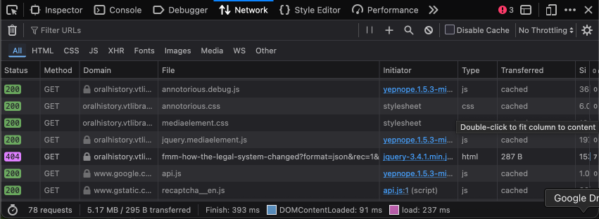
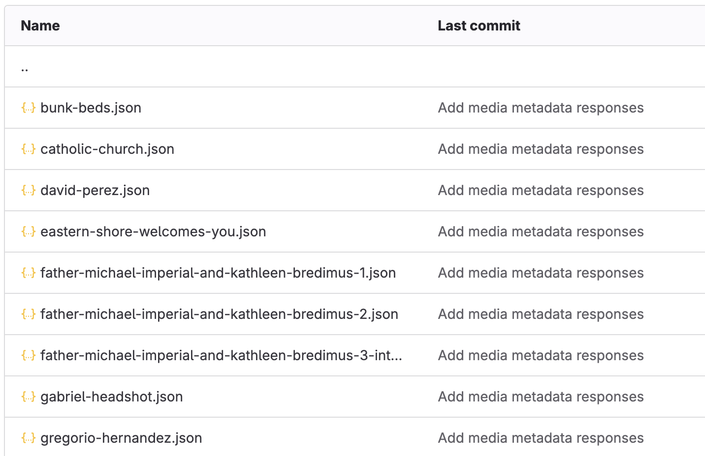
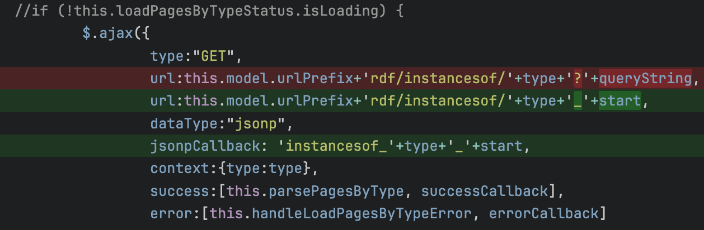
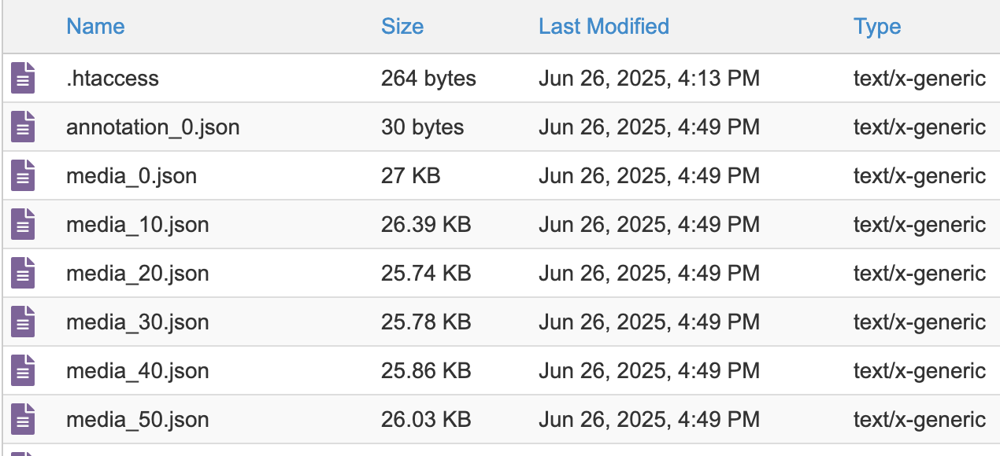

# Scalar Staticify Resources

This is a supplementary resource in creating static copies of Scalar sites. All the scripts referenced in this guide will have a copy in the [scripts](./scripts) folder, and all the referenced images will be in the [images](./images) folder. The original Scalar site (for now) is at the `oralhistory.vt.domains` domain ([link](https://oralhistory.vt.domains/migrant-works-of-the-virginia-tidewater/index)) and the created static copy is hosted at the `oralhistory.vtlibraries.com` domain ([link](https://oralhistory.vtlibraries.com/migrant-works-of-the-virginia-tidewater/index)). We will use this site as an example in the guide.

## Get a copy of the base files using wget

```bash
#!/bin/bash
wget \
 --force-directories \
 --recursive \
 --html-extension \
 --page-requisites \
 --domains oralhistory.vt.domains \
 --no-parent \
 -e robots=off \
 https://oralhistory.vt.domains/migrant-works-of-the-virginia-tidewater/
 ```
Source: [wget.sh](./scripts/wget.sh)

Note that we did not put a `/index` at the end of the URL even though that's the default index page, as this prevents files which aren't under index in the directory hierarchy from being indexed.

A brief explanantion of the `wget` switches -

* `--force-directories` - Lets wget create directories to preserve the hierarchy of the files downloaded
* `--recursive` - Allows it to follow links it encounters on pages
* `--html-extension` - Instructs it to append the .html extension to the files it creates, otherwise they will be extension-less
* `--page-requisites` - Makes it fetch all the dependencies (embedded images, referenced CSS and JavaScript files) on a page
* `--domains` - Limits its page fetches to particular domains – in this case `oralhistory.vt.domains`
* `--no-parent` - Limits the resources it fetches to the current directory
* `-e robots=off` - This disregards any `nofollow` directive it finds in the pages or on robots.txt. Some of the Scalar sites we looked at had that on.

At the end of this stage, you'll have a mostly-complete copy of the site with the right directory structure of files.

## Copy needed files

We now copy over a few JavaScript files and images from the Scalar install into our static sites for the pages to reference them. These need to be put into the exact same locations as they were in the Scalar site. These directories are -

```
/system/application/views/arbors/html5_RDFa/js/
/system/application/views/melons/cantaloupe/css/
/system/application/views/melons/cantaloupe/images/
/system/application/views/widgets/
```

For the `/system/application/views/widgets` folder, we skip the CKEditor subfolder, which has PHP files.

Next, we also copy over any of the media files which have not been copied over by wget. These should be in the `/migrant-works-of-the-virginia-tidewater/media` folder, and should be copied into the same location in the new site.

It is also important to change the URLs in the pages to reflect the new URL. This is pertinent if we are making the static site load at a new domain or a new directory. The command to do this is -

```bash
find ./ -type f -exec sed -i 's/olddomain.com/newdomain.com/g' {} \;
```
Source: [findnreplace.sh](./scripts/findnreplace.sh)

This looks in all files under the current directory for the occurrence of `olddomain.com` and changes them to `newdomain.com`. If we are just changing directories, we can also substitute this with the name of the old directory and the new directory respectively.

Note that this step needs to be taken every once in a while as we are working through the steps. As we import/create new files, it’s important to change any occurrences of the old domain or the directory in them to the new one so that things are referenced correctly.

## Web server configuration

Many of the HTML files which are named `this-is-the-name.html` needs to be loaded as `this-is-the-name` (without the extension). This is handled elegantly in Nginx using this config -

```
server {
    listen       80 http2;
    listen  [::]:80 http2;
    server_name  oralhistory.vtlibraries.com;

    root   /usr/share/nginx/html/oralhistory.vtlibraries.com/public_html;

    # Redirect home page to index
    location = /migrant-works-of-the-virginia-tidewater/ {
        return 302 https://oralhistory.vtlibraries.com/migrant-works-of-the-virginia-tidewater/index;
    }

    # Load index.json for /lenses
    location /system/lenses/ {
        index index.json;
    }

    # Load medianame.json for medianame requests
    location /migrant-works-of-the-virginia-tidewater/rdf {
        try_files $uri.json $uri =404;
    }

    location / {
        index  index.html index.htm;
        # Load uri.html for /uri
        try_files $uri $uri/ $uri.html =404;
    }
}
```
Source: [vhost.conf](./webserver-config/nginx/vhost.conf)

For Apache, we add `.htaccess` files to a few locations, wherever we need to load HTML and JSON files without extension. Those locations are -
```
$ find . -type f -name ".htaccess"
./migrant-works-of-the-virginia-tidewater/.htaccess
./migrant-works-of-the-virginia-tidewater/media/.htaccess
./migrant-works-of-the-virginia-tidewater/rdf/node/media/.htaccess
./migrant-works-of-the-virginia-tidewater/rdf/node/
./migrant-works-of-the-virginia-tidewater/rdf/instancesof/.htaccess
./system/lenses/.htaccess
```

All these `.htaccess` files can be found in the [webserver-config/apache](./webserver-config/apache/) folder. Here's one -
```
# Location: /migrant-works-of-the-virginia-tidewater/media/.htaccess
RewriteEngine On
RewriteBase /
RewriteCond %{REQUEST_FILENAME} !-f
RewriteCond %{REQUEST_FILENAME} !-d
RewriteCond %{REQUEST_FILENAME}.html -f
RewriteRule ^(.+)$ /migrant-works-of-the-virginia-tidewater/media/$1.html [L,QSA]
```
Source: [media_htaccess](./webserver-config/apache/media_htaccess)

Note that instead of having multiple `.htaccess` files in different locations, this could theoretically be combined into a single `.htaccess` file in the root. Feel free to open an issue or a pull request if you want to explore it.

## XHR requests and jsonpCallbacks

At this point, the site should load, but none of the media or menu items will appear. To rectify this, we need to create JSON files for each of those responses and use a bit of web server tweaking to have them load at the expected place. Note that we have already done the webserver configuration if we have followed the previous step.

But before we can begin this process, we need to make sure the JSON responses have a predictable and consistent callback. The way it is coded in scalarapi.js, each JSON request and response has a randomly generated string of digits as the callback function.

```json
jQuery34109919096372851329_1755031361525({
  "https://oralhistory.vt.domains/migrant-works-of-the-virginia-tidewater/media/eastern-shore-welcomes-you" : {
    "http://www.w3.org/1999/02/22-rdf-syntax-ns#type" : [
      { "value" : "http://scalar.usc.edu/2012/01/scalar-ns#Media", "type" : "uri" }
    ],
    "http://scalar.usc.edu/2012/01/scalar-ns#isLive" : [
      { "value" : "1", "type" : "literal" }
    ],
    "http://simile.mit.edu/2003/10/ontologies/artstor#thumbnail" : [
      { "value" : "media/Eastern Shore_thumb.png", "type" : "literal" }
    ],
    "http://www.w3.org/ns/prov#wasAttributedTo" : [
      { "value" : "https://oralhistory.vt.domains/migrant-works-of-the-virginia-tidewater/users/1", "type" : "uri" }
    ],
```

_Snippet of an AJAX response with a randomly generated callback. Note the `jQuery34109919096372851329_1755031361525` at the beginning of this snippet_

To create a predictable and consistent callback, we make a few modifications in the `/system/application/views/widgets/api/scalarapi.js` file using the `jsonpCallback` parameter.

We also sanitize and cleanup the `jsonpCallback` parameter by using chained `replaceAll` methods to replace ‘/’ and ‘-’ with underscores.

```diff
diff --git a/system/application/views/widgets/api/scalarapi.js b/system/application/views/widgets/api/scalarapi.js
index 4bf3877..e703fcc 100644
--- a/system/application/views/widgets/api/scalarapi.js
+++ b/system/application/views/widgets/api/scalarapi.js
@@ -2155,6 +2155,7 @@ ScalarAPI.prototype.loadNode = ScalarAPI.prototype.loadPage = function(uriSegmen
                                type:"GET",
                                url:this.model.urlPrefix+'rdf/node/'+uriSegment+'?'+queryString,
                                dataType:"jsonp",
+                                jsonpCallback: uriSegment.replaceAll("/", "_").replaceAll('-','_'),
                                context:this,
                                success:[this.parsePage, successCallback],
                                error:[this.handleLoadPageError, errorCallback]
@@ -2258,6 +2259,7 @@ ScalarAPI.prototype.loadCurrentNode = ScalarAPI.prototype.loadCurrentPage = func
                                type:"GET",
                                url:this.model.urlPrefix+'rdf/node/'+this.stripVersion(this.basepath(document.location.href))+'?'+queryString,
                                dataType:"jsonp",
+                               jsonpCallback: this.stripVersion(this.basepath(document.location.href)).replaceAll("/", "_").replaceAll('-','_'),
                                context:this,
                                success:[this.parseCurrentPage, successCallback],
                                error:[this.handleLoadCurrentPageError, errorCallback]
@@ -2471,8 +2473,9 @@ ScalarAPI.prototype.loadNodesByType = ScalarAPI.prototype.loadPagesByType = func
                //if (!this.loadPagesByTypeStatus.isLoading) {
                        $.ajax({
                                type:"GET",
-                               url:this.model.urlPrefix+'rdf/instancesof/'+type+'?'+queryString,
+                               url:this.model.urlPrefix+'rdf/instancesof/'+type+'_'+start,
                                dataType:"jsonp",
+                                jsonpCallback: type+'_'+start,
                                context:{type:type},
                                success:[this.parsePagesByType, successCallback],
                                error:[this.handleLoadPagesByTypeError, errorCallback]
```
Source: [scalarapi.diff](./scripts/scalarapi.diff)

At this point we can start creating copies of the XHR JSON responses in the rdf folder. There are three locations in which different kinds of responses are stored -

- `/rdf/node` - These contain metadata about non-image resources like YouTube videos, etc.
- `/rdf/node/media` - These contain metadata about images
- `/rdf/file/media` - These contain miscellaneous media

The Console and the Network tab in the web browser’s Developer View are the most useful tools while troubleshooting XHR requests for missing elements. We were able to find the pattern and the location of most of our missing media by making good use of these tools.



_Image: Developer tools of the Mozilla Firefox browser with a missing media element XHR request (Pink 404 request for missing metadata amid green 200s)_

We download the missing metadata and put them into files like this -

```bash
wget 'https://oralhistory.vt.domains/migrant-works-of-the-virginia-tidewater/rdf/node/mateo-gomez-full-interview?format=json&rec=1&ref=1&prov=0&versions=0&callback=mateo_gomez_full_interview&_=1752509788889' -O mateo-gomez-full-interview.json
```

It is a good idea to generate these .json files for every piece of media in the Scalar install. We can get a handy list of those by running this piece of SQL query on the Scalar database -

```sql
SELECT `slug` FROM `scalar_db_content` WHERE `type` = "media" AND `book_id` = 3;
```

Replace 3 with the book_id of your Scalar book.

In order to get all image media, we can tweak the query a little bit -

```sql
SELECT * FROM `scalar_db_content` WHERE `type` = "media" AND `book_id` = 3 AND `thumbnail` LIKE "media/%";
```

The folders should now have JSON files containing the responses.


_Image: Directory listing of the rdf/node/media folder with .json responses_

We have also made the necessary changes to load these JSON files without the extension, in the Nginx config, or added `.htaccess` files for Apache in the [Web Server Configuration](#web-server-configuration) section.

```
# Location: /migrant-works-of-the-virginia-tidewater/rdf/node/media/.htaccess
DirectoryIndex index.json
Options +FollowSymlinks
RewriteEngine On
RewriteBase /
RewriteCond %{REQUEST_FILENAME} !-f
RewriteCond %{REQUEST_FILENAME} !-d
RewriteCond %{REQUEST_FILENAME}.json -f
RewriteRule ^(.+)$ /migrant-works-of-the-virginia-tidewater/rdf/node/media/$1.json [L,QSA]
```
Source: [rdf_node_media_htaccess](./webserver-config/apache/rdf_node_media_htaccess)

This allows a request for `https://oralhistory.vtlibraries.com/migrant-works-of-the-virginia-tidewater/rdf/node/medianame` to be loaded from `https://oralhistory.vtlibraries.com/migrant-works-of-the-virginia-tidewater/rdf/node/medianame.json`.

One of the JSON response files - 
```json
media_bunk_beds({
  "https://oralhistory.vtlibraries.com/migrant-works-of-the-virginia-tidewater/media/bunk-beds" : {
    "http://www.w3.org/1999/02/22-rdf-syntax-ns#type" : [
      { "value" : "http://scalar.usc.edu/2012/01/scalar-ns#Media", "type" : "uri" }
    ],
    "http://scalar.usc.edu/2012/01/scalar-ns#isLive" : [
      { "value" : "1", "type" : "literal" }
    ],
    "http://simile.mit.edu/2003/10/ontologies/artstor#thumbnail" : [
      { "value" : "media/Bunk beds_thumb.JPG", "type" : "literal" }
    ],
    "http://www.w3.org/ns/prov#wasAttributedTo" : [
      { "value" : "https://oralhistory.vtlibraries.com/migrant-works-of-the-virginia-tidewater/users/1", "type" : "uri" }
    ],
    "http://purl.org/dc/terms/created" : [
      { "value" : "2023-12-08T20:25:44+00:00", "type" : "literal" }
    ],
    "http://scalar.usc.edu/2012/01/scalar-ns#urn" : [
      { "value" : "urn:scalar:content:180", "type" : "uri" }
```

We then go through the same set of steps for any embedded YouTube videos whose metadata should reside in the `/rdf/node` folder.

And finally, we repeat the steps for the Table of Contents’ Index items for the top navigation bar. Here, the code is a little different as we have to account for paginated results. In addition to adding a `jsonpCallback` parameter, we also need to update the location of the XHR request to have the start parameter coded into the body of the URL instead of being in the query string. We have applied this change already using the patch file at the beginning of the section, but here are the changes for illustrative purposes.


_Image: The change in scalarapi.js for the Index items_

And the JSON response files should look like this -



`media_0.json` has media listing from 0 through 10, and `media_10.json` has results from 10 through 20 and so on.

At this point we should have an almost fully functional static copy of a Scalar site. Certain functionality like Lenses, we have not put effort into replicating, as we do not use them much, if at all, but we’re sure that can be replicated in the same manner with hardcoded JSON responses and web-server trickery to have those responses load at the right URLs.

## Miscelleneous

We noticed that an XHR query for `/system/lenses/?book_id=3` was being generated on every page - presumably to check for the existence of the lenses. Since we do not use any lense, this query always gives an empty JSON response. So we add an `index.json` with the content `[]` and add an `.htaccess` there so that the proper response is sent.

```json
[]
```
Content of `/system/lenses/index.json`

```
DirectoryIndex index.json
```
Source: [system_lenses_htaccess](./webserver-config/apache/system_lenses_htaccess)
